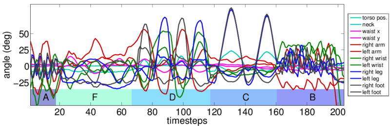

This is the repository for a dataset of motion capture sensor traces, annotated to indicate which exercise among a set of 12 possible exercises was performed at each timestep. 



Academic Citation
-----

Fox, E., Hughes, M., Sudderth, E., and Jordan, M. "Joint modeling of multiple time series via the beta process with application to motion capture segmentation." Annals of Applied Statistics (2014). Volume 8, Number 3, Pages 1281-1313.

See Fig. 1 for a description of this dataset.


Dataset
-----

Available as MAT file: `mocap6.mat`. 

Description of fields stored in this file:
```
% * DataBySeq, 1D array of structs.
%    Each entry n is a struct for a single sequence, with fields
%    - X : 2D array, T x D
%        Each row t is observed data vector (size D) at time interval t
%    - Xprev : 2D array, T x D
%        Each row t is previous observation (size D) for time interval t
%        This field is used by auto-regressive models, ignored by others.
%    - TrueZ : 2D array, T x 1
%        Each entry t is the int label of human-annotated action at time t.
%    - filename : string
%        Indicates which record on mocap.cs.cmu.edu this came from.
%        Format: <subjectID trialID>, like 14_06 or 13_30.
% * ActionNames : 1D cell array of strings
%    each entry k is the name of the action referred to when TrueZ(t)==k
% * ChannelNames : 1D cell array of strings
%    each entry d is the name of the sensor for dimension d of X/Xprev
```


Dataset details
-----
Six sequences were collected from files available at mocap.cs.cmu.edu:
* Subject 13: trials 29, 30, and 31
* Subject 14: trials 6, 14, and 20

These sequences were then post-processed as follows

* A subset of 12 sensor channels were kept as representative of gross motor behavior. Remaining channels were discard.
* Each column (sensor channel) was adjusted to have zero-mean.
* Each column was block-averaged to a final frame rate of 10 fps (down from 120 fps in the raw data). 

Exact matlab code to reproduce this post-processing is in preproc-code/.


Annotation details
-----

Integer labels for each sequence, assigning each timestep (after post-processing) into one of 12 behavior categories indexed {1,2,...12} are found in the truelabels/ directory. The 12 action names are:

```
    'JumpJack', 'Jog', 'Squat', 'KneeRaise', 'ArmCircle', ...
    'Twist', 'SideReach', 'Box', 'UpDown', 'ToeTouchOneHand', ...
    'SideBend', 'ToeTouchTwoHands' ...
```

Credits
-----
This repository was assembled by Mike Hughes (Brown University).
Mike cleaned up the code and refined the annotations.

The dataset was originally assembled by E. Fox and E. Sudderth in 2009.
E. Fox did the original annotation.

Thanks to CMU for making the raw data available.

